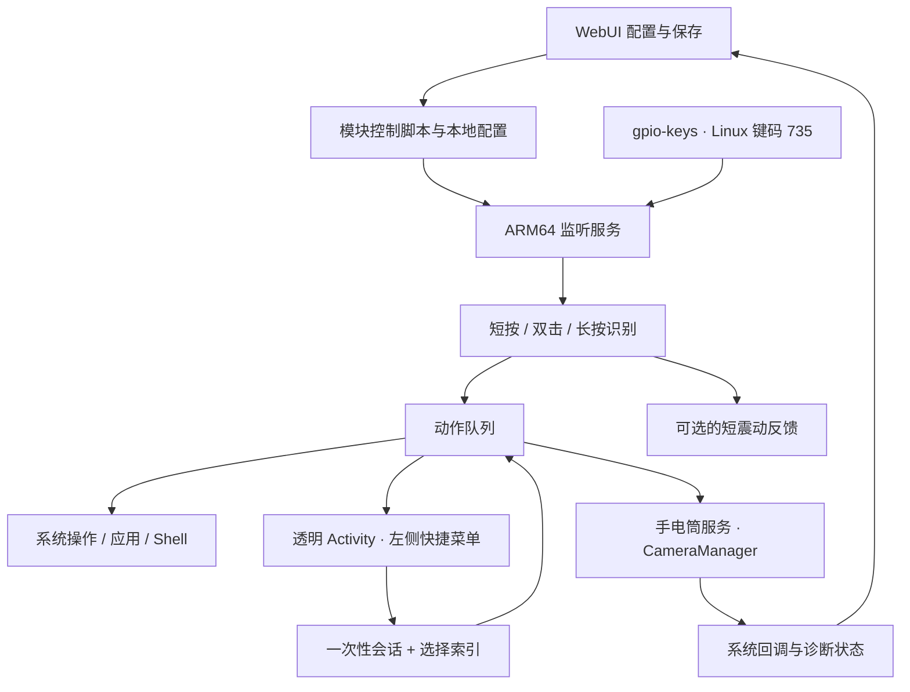

<div align="center">

# findx8s sidekey

### 一颗侧键，三种手势，按你的习惯工作。

为 **OPPO Find X8s** 开发的 KernelSU 侧键自定义模块。<br>
在 WebUI 中配置短按、双击和长按，把手电筒、相机、媒体控制和常用操作放在指尖。

[](https://github.com/zhujiu39/findx8s-sidekey/releases/tag/v0.4.0)
[](#compatibility)
[](#compatibility)
[](https://kernelsu.org/)
[](LICENSE)

[下载模块](https://github.com/zhujiu39/findx8s-sidekey/releases/tag/v0.4.0) ·
[快速开始](#quick-start) ·
[支持的动作](#actions) ·
[常见问题](#faq) ·
[从源码构建](#build) ·
[反馈问题](https://github.com/zhujiu39/findx8s-sidekey/issues)

</div>

> [!TIP]
> 想直接安装？下载 **[test_oppo_sidekey_v0.4.0.zip](https://github.com/zhujiu39/findx8s-sidekey/releases/download/v0.4.0/test_oppo_sidekey_v0.4.0.zip)**，在 KernelSU 管理器中安装并重启。Release 附带 `SHA256SUMS.txt`；GitHub 自动生成的 **Source code** 压缩包用于开发，不能直接安装。

> [!IMPORTANT]
> 当前是 **v0.4.0 功能测试版**。侧键输入设备与键码已通过 ADB 确认，本地构建和自动化测试已通过；快捷菜单在 ColorOS 上的弹出与点击，以及系统手电筒、图标同步、震动和锁屏／息屏响应仍需目标手机验证。详细范围见[兼容性与验证状态](#compatibility)。

## ✨ 一眼看懂

你可以给同一个侧键安排三件不同的事。例如：

| 手势 | 示例配置 | 使用方式 |
| --- | --- | --- |
| 短按 | 打开相机 | 按一下，打开拍照入口 |
| 双击 | 播放／暂停 | 连按两次，控制当前媒体 |
| 长按 | 切换手电筒 | 按到设定时长，轻震一次并切换灯光 |

**以上只是搭配示例。** 首次安装默认暂停接管，三个动作均为“不执行动作”，由你在 WebUI 中选择后启用。

| 能力 | 说明 |
| --- | --- |
| 三种手势独立配置 | 短按、双击、长按分别选择动作，也可单独设为不执行 |
| 替换原有侧键功能 | 开启接管后，由模块处理该侧键；关闭并保存即可恢复系统接收 |
| 左侧滑出菜单 | 侧键触发后从左侧平滑滑出；空白起步，支持名称、emoji、动作和排序 |
| 离线 WebUI | 配置动作、调节手感、测试动作、查看状态和日志 |
| 系统手电筒 | 通过 Android 相机服务切换状态，使用系统公开的最高亮度档位 |
| 触发反馈 | 有效动作触发时请求一次 35 ms 短震动，可关闭 |
| 自定义操作 | 启动指定应用、发送 Android 按键，或运行自定义 Shell |

<a id="compatibility"></a>

## 📱 兼容性与验证状态

| 项目 | 当前范围 |
| --- | --- |
| 目标机型 | **OPPO Find X8s（PKT110）** |
| 目标系统 | Android 15 / ColorOS；其他系统版本尚未验证 |
| 架构 | ARM64；监听程序为静态 ELF，加载段按 16 KB 对齐 |
| Root 环境 | 已安装并正常工作的原版 KernelSU |
| 管理入口 | KernelSU 模块页面中的 WebUI |
| 侧键识别依据 | `gpio-keys`，Linux 输入键码 **735 / 0x02DF** |
| 安装检查 | 仅接受 KernelSU、ARM64、Android 15 及以上；通过检查不等于已完成机型适配 |
| 其他机型或 Root 方案 | 尚未验证，不作为通用按键映射模块发布 |

安装这个模块无需重新修补 `boot` / `init_boot`，不依赖元模块或 Zygisk。模块不覆盖系统 keylayout，不修改内核或系统分区。

| 验证项目 | 状态 |
| --- | --- |
| 目标侧键的设备名称、键码与按下／松开事件 | 已通过 ADB 采集确认 |
| C 手势状态机、配置校验与旧配置兼容 | 本地测试通过 |
| Java 手电筒状态逻辑、外部状态变化与超时处理 | 本地测试通过 |
| WebUI 配置、桥接模拟与手机尺寸预览 | 本地检查通过 |
| ARM64 ELF、DEX、菜单 APK 签名、脚本语法及安装 ZIP | 构建与校验通过 |
| 完整接管、ColorOS 菜单启动与点击、系统手电筒、震动和锁屏／息屏行为 | 待目标手机实机验证 |

原始适配依据见[侧边按键识别结果](diagnostics/侧边按键识别结果.md)，本地检查及实机待测项见[模块本地验证](diagnostics/模块本地验证.md)。

<a id="quick-start"></a>

## ⚡ 快速开始

### 第一次安装

1. 从 [Releases](https://github.com/zhujiu39/findx8s-sidekey/releases/tag/v0.4.0) 下载 `test_oppo_sidekey_v0.4.0.zip`。
2. 打开 **KernelSU → 模块 → 从本地安装**，选择 ZIP，安装完成后重启。
3. 从模块卡片打开 **WebUI**，为短按、双击、长按选择动作。
4. 按需设置长按时间、双击间隔和“触发时震动”。
5. 打开 **“接管侧边键”**，点击 **“保存设置”**。正常接管时，页面会显示“侧键已接管”。
6. 使用各手势旁的 **“测试”** 检查已保存动作，再尝试实际按键。

设置需要点击保存才会应用；配置通常在半秒内生效，状态页面约每 2.5 秒刷新一次。测试按钮执行的是已保存动作，有未保存修改时不能测试。

### 把长按设为手电筒

在 **“长按”** 中选择 **“切换手电筒（系统最高亮度）”**，保存后等待几秒，让手电筒服务完成初始化。随后长按开灯，再次长按关灯；“运行状态与日志”可查看系统手电筒状态及亮度上限。

### 把侧键设为快捷菜单

1. 将短按、双击或长按中的一个动作改为 **“弹出快捷菜单”**。
2. 在 **“你的快捷菜单”** 中点击 **“＋ 添加捷径”**，填写名称和可选 emoji，再选择执行动作。支持系统操作、应用、手电筒、Android 按键及 Shell，最多 **12 项**。
3. 用 ↑ / ↓ 调整顺序，或删除项目。菜单默认空白，不替你预置任何内容。
4. 默认从屏幕 **左侧** 滑出，面板中心高度默认 **35%**，可调整至 10%～90%；也能改为右侧。靠近屏幕边缘时会自动限制位置，长菜单可以滚动。
5. 点击 **“预览滑出效果”** 检查外观，再保存设置。网页预览不执行动作；手势卡片的 **“测试”** 才会请求打开手机上的菜单。

手机菜单使用短暂的透明 Activity：左侧滑入，点击空白处或返回键滑出，选择项目时先收起再提交动作。每次菜单会话最长 60 秒；修改配置、暂停服务或关闭模块后会话失效。**锁屏时不显示，也不负责唤醒屏幕或解锁。**

模块重启后会自动安装 **“侧键快捷菜单”** 组件（`cn.sidekey.menu`），不显示桌面图标，可在系统应用管理中找到。无需悬浮窗、无障碍或单独的 Root 授权。组件仅通过 `127.0.0.1` 与模块通信，Android 的 `INTERNET` 权限用于本机连接；没有远端地址、统计或上传。实际动作参数和 Shell 命令只保留在 Root 服务中，组件只能用一次性会话选择预先配置的项目。

如果没有弹出，请在 WebUI 点击 **“准备 / 修复菜单组件”**，等几秒后查看 **“运行状态与日志 → 菜单组件”**。安装错误与 Android 启动错误会显示在那里。ColorOS 是否允许当前 ROM 的后台启动路径，需要刷入实测。

### 从旧版升级

- 在 KernelSU 中覆盖安装新版并重启，已有配置会保留；v0.4.0 不自动改动你的手势，菜单初始为空。
- 如果此前用 Shell 直接控制 LED，先用旧脚本关灯，再升级。
- 升级后，手动将对应动作改为内置手电筒并保存；模块不会自动替换你的 Shell 命令。
- v0.3.1 对旧配置默认开启触发震动，可以在“手感调节”中关闭并保存。

<a id="actions"></a>

## 🎛️ 支持的动作

| 类别 | 可选动作 | 需要填写什么 |
| --- | --- | --- |
| 快捷菜单 | 弹出可自定义的侧边面板 | 在“你的快捷菜单”添加内容；菜单内不支持递归打开菜单 |
| 系统导航 | 回到桌面、返回上一页、最近任务 | 无 |
| 快捷操作 | 展开通知栏、展开快捷设置、截屏、息屏 | 无 |
| 媒体控制 | 播放／暂停、上一首、下一首、增大／减小音量、切换媒体静音 | 无 |
| 相机与灯光 | 打开相机、切换手电筒 | 无 |
| 启动应用 | 打开指定应用的启动入口 | 应用包名，例如 `com.android.settings` |
| Android 按键 | 发送 Android KeyEvent | `1～2047` 的整数，例如 `3` 为主页 |
| 自定义 Shell | 执行自己的命令 | 例如 `input keyevent 3` |
| 不执行动作 | 对应手势不触发动作和震动 | 无 |

“运行状态与日志”中的 **“读取应用包名”** 可读取当前 Android 用户的已安装包名，辅助填写应用动作。不同系统对截屏、锁屏启动应用等操作的限制，需要在设备上确认。

自定义 Shell 以 **Root** 身份执行，参数最多 **512 个 UTF-8 字节**；单次动作最长 **10 秒**。动作返回或超时后会清理该动作进程组中的后台子进程，因此这里适合短命令，不用于启动长期常驻脚本。

## 🤏 手势与震动

| 设置 | 默认值 | 可调范围 |
| --- | --- | --- |
| 长按触发时间 | 600 ms | 250～2000 ms |
| 双击最大间隔 | 280 ms | 150～600 ms |
| 触发时震动 | 开启，单次请求 35 ms | 开启／关闭；时长固定 |

- **短按**：未配置双击动作时，松开即执行；配置双击后，等待双击窗口结束再执行。
- **双击**：第一次松开到第二次按下不超过双击窗口，第二次松开时执行。若第二次按住达到长按阈值，只执行长按。
- **长按**：达到阈值时执行一次，继续按住或松手均不会重复执行，也不会再补一次短按。
- **震动**：有效手势进入动作队列时请求一次，WebUI 动作测试也会包含反馈。设为“不执行动作”、暂停接管或队列已满时，物理按键不触发反馈。

震动表示手势已接收，不表示后续动作一定成功。它在独立子进程中请求系统震动，遵循系统震动与勿扰策略；失败仅记录日志，不阻止动作执行。保存新配置会取消尚未完成的手势和排队动作，已按住的键需先松开。

## 🔦 系统手电筒

手电筒通过 **Android CameraManager** 控制，由 **TorchCallback** 接收实际状态变化。设计目标是让侧键与系统控制中心使用同一套状态：从控制中心改变灯光后，侧键依据新状态继续切换。

- 相机服务公开多档亮度时，使用 `FLASH_INFO_STRENGTH_MAXIMUM_LEVEL` 报告的最高档。
- 只公开一档时，使用系统默认亮度；“最高亮度”指系统开放的上限，仍受系统温控等限制。
- 相机占用、接口拒绝和状态确认超时都会报告失败，不会把失败写成已开灯。
- WebUI 展示可用性、开关状态、实际亮度／上限和错误日志。

**ColorOS 在这台设备上开放的亮度档位及控制中心图标表现，仍需实机确认。** 旧 Shell 直接写入 LED 节点的运行结果，不代表当前系统接口已通过验证。

<a id="faq"></a>

## ❓ 常见问题

<details>
<summary><strong>安装后为什么按键没有变化？</strong></summary>

首次安装默认暂停接管，所有动作均为“不执行动作”。请先选择动作，再打开“接管侧边键”并保存。如果“监听服务”没有运行，可以点击“启动监听服务”；如果提示找不到设备或接管失败，请记录页面错误，暂时关闭接管。

</details>

<details>
<summary><strong>开启后，原来的系统功能还会触发吗？如何恢复？</strong></summary>

正常接管时，模块独占目标输入设备，系统原有侧键功能被替换。即使某个手势设为“不执行动作”，它也不会回到系统功能。

恢复原功能：关闭“接管侧边键”并保存。停用模块：在 KernelSU 中禁用，必要时重启。卸载会停止监听、删除模块自己的配置目录，并尝试移除菜单组件；如果卸载时系统包管理器不可用，可在系统应用管理手动移除“侧键快捷菜单”。

</details>

<details>
<summary><strong>为什么设置双击后，短按会慢一点？</strong></summary>

模块需要等待双击窗口，判断这次操作是短按还是双击。可以缩短“双击最大间隔”，或者把双击设为“不执行动作”，让短按在松开时执行。

</details>

<details>
<summary><strong>灯不够亮、图标没同步，或开灯失败怎么办？</strong></summary>

先确认动作已改成内置“切换手电筒（系统最高亮度）”，而不是旧 Shell。保存后等待服务初始化，再查看“系统手电筒”中的状态、最高档位和错误日志。上限只有一档时，模块只能使用系统默认亮度；相机占用或接口被系统拒绝时也可能失败。反馈时提供模块版本、ROM 版本、复现步骤和相关错误片段。

</details>

<details>
<summary><strong>触发动作但没有震动，是什么原因？</strong></summary>

先检查“触发时震动”已开启并保存，再检查系统震动和勿扰设置。震动调用失败不会取消动作；相关退出码会写入日志。系统命令返回成功也只代表请求提交，实际马达响应仍需设备验证。

</details>

<details>
<summary><strong>为什么暂停接管后，手电筒服务还在？</strong></summary>

只要配置中保留手电筒动作，服务就会继续存在，以便 WebUI 的“测试”按钮使用它。服务保持相机服务客户端存活，不采集图像或运行相机预览。正常禁用、卸载或停止模块监听进程时，手电筒服务随之终止，系统释放该客户端持有的灯光。

</details>

<details>
<summary><strong>支持其他手机吗？Linux 键码 735 能直接填进 Android 按键动作吗？</strong></summary>

当前针对 Find X8s 的 `gpio-keys` 和 Linux 键码 735 进行识别。程序动态查找设备，不固定 `/dev/input/event0`；若同一设备还承载其他按键，则拒绝独占。其他机型需要重新确认设备与按键映射。

Linux evdev 键码与 Android KeyEvent 是不同的编码体系。735 是模块识别物理侧键的依据，不能据此把它当成 `input keyevent` 的对应值。

</details>

<a id="build"></a>

## 🛠️ 从源码构建

当前构建脚本面向 **Windows x64**。先安装 **Git（含 Git Bash）、Python 3、Node.js**，确保 `git`、`python`、`node` 可从命令行运行。

```powershell
git clone https://github.com/zhujiu39/findx8s-sidekey.git
cd findx8s-sidekey

# 下载并校验本地 JDK 21、Android API 35 和 Build Tools 35
python bootstrap_android.py

# 首次构建：需要时下载 Zig 0.15.2，然后编译、测试、打包
python build.py --bootstrap
```

工具准备完成后，使用 `python build.py` 重新构建。Android 工具位于忽略提交的 `tools/android/`，Zig 也保存在 `tools/`；已有 Zig 时可通过 `ZIG` 环境变量指定路径。当前脚本使用 Windows 版工具路径，Linux / macOS 构建流程尚未适配。

每次完整构建都会执行 C、Java、JavaScript 测试，以及配置往返、Shell 语法、ELF、DEX、APK 签名和 ZIP 校验，并新建独立的 `交付文件/时间_test_v0.4.0_左侧快捷菜单/` 目录。目录内包含安装包、源码与测试、说明文档、真实构建日志和 SHA256。

菜单 APK 使用 API 35 编译，随模块 ZIP 一起分发。首次构建会在 **被 Git 忽略的 `tools/private/`** 生成本地签名私钥和口令文件，后续构建复用；请自行备份，**不要提交或公开这两个文件**。源码包和 Release 不包含私钥。自行构建的签名与仓库发布版本不同，交叉安装提示签名冲突时，先在手机应用管理中卸载旧菜单组件，再点 WebUI 的“准备 / 修复菜单组件”；手势与菜单配置保存在模块目录，不受单独卸载组件影响。

只运行 WebUI 单元测试：

```powershell
node --test tests/webui.test.js
```

本地预览 WebUI：

```powershell
python -m http.server 8765 --bind 127.0.0.1 --directory module/webroot
```

浏览器打开 `http://127.0.0.1:8765`。普通浏览器显示界面预览，不能代替 KernelSU WebUI 执行 Root 操作，也不代表真实按键、灯光或马达已经通过测试。

## 🧩 工作原理



<details>
<summary><strong>实现细节与运行边界</strong></summary>

- 输入接管使用 `EVIOCGRAB`；监听进程退出后，内核释放独占权。
- 监听程序为 `aarch64-linux-musl` 静态 ELF，加载段按 16 KB 对齐。
- Java 手电筒服务由 `app_process` 承载，通过仅允许 UID 0 的本机抽象 Unix 套接字接收请求；父进程退出时联动清理。
- 手电筒动作等待上限为 8 秒；已提交的切换请求不会自动重发，避免一次操作切换两次。
- 普通动作最长运行 10 秒，队列最多等待 4 项；溢出在日志中报告。
- 震动反馈独立执行，最多 4 个并发请求，每个请求 2 秒超时。
- 模块 ID 为 `oppo_sidekey`，持久配置与日志位于 `/data/adb/oppo_sidekey/`，目录权限为 `0700`。升级保留，卸载删除。
- 配置采用严格解析的文本格式，参数以 UTF-8 十六进制保存并原子替换，不作为 Shell 文件直接加载。
- 菜单接口只监听本机回环地址的随机端口；打开请求使用 Root 私有令牌，点击请求使用 256 位一次性随机令牌，60 秒后失效。限制连接数量、请求长度和等待时间，不接受客户端传入的命令。
- WebUI 离线运行，不加载 CDN，也不上传设备信息。

</details>

## 🗂️ 项目结构

```text
findx8s-sidekey/
├─ native/                   # 监听服务、手势、配置、手电筒 IPC 与震动
├─ android/cn/sidekey/        # CameraManager 服务与可独立测试的状态逻辑
├─ companion/                # 快捷菜单 Android Activity、Manifest 与主题
├─ module/
│  ├─ webroot/               # 离线 WebUI
│  ├─ scripts/               # 配置保存、服务控制与动作测试入口
│  ├─ LICENSES/              # 随模块分发的许可证
│  ├─ bin/sidekey            # 构建生成的 ARM64 程序
│  └─ lib/                   # 构建生成的 torch.jar 与 sidekey-menu.apk
├─ tests/                    # C、Java、JavaScript 测试
├─ diagnostics/              # 侧键适配依据与验证记录
├─ bootstrap_android.py      # 下载并校验 Android 编译工具
├─ build.py                  # 编译、验证、打包
├─ README.md
├─ THIRD_PARTY_NOTICES.md
└─ LICENSE
```

## 📝 更新记录

| 版本 | 主要变化 |
| --- | --- |
| **v0.4.0** | 新增左侧滑出快捷菜单、空白 DIY 项目、排序、位置调节、WebUI 预览与自动准备菜单组件 |
| v0.3.1 | 新增 35 ms 触发震动、WebUI 反馈开关、旧配置兼容；公开发布源码与 MIT 许可证 |
| v0.3.0 | 新增系统手电筒动作、最高公开亮度、真实状态回调与诊断信息 |
| v0.2.0 | 实现侧键独占接管、三种手势、离线 WebUI、持久配置与动作超时 |

完整记录见 [Commits](https://github.com/zhujiu39/findx8s-sidekey/commits/main)，安装文件见 [Releases](https://github.com/zhujiu39/findx8s-sidekey/releases)。

## 🤝 反馈与贡献

欢迎通过 [Issues](https://github.com/zhujiu39/findx8s-sidekey/issues) 提交问题。为了便于复现，请提供：

- 手机型号、Android / ColorOS 版本、KernelSU 版本与模块版本。
- 配置的手势和动作、预期效果、实际表现及是否处于锁屏／息屏状态。
- WebUI 的服务状态和与问题有关的错误日志片段。

提交前请去掉手机序列号、账号、令牌、私人应用信息以及 Shell 命令中的敏感内容。机型适配或功能修改可通过 Pull Request 提交，并附上测试结果。

## 📄 许可证与致谢

原创代码使用 [MIT License](LICENSE)。musl、Zig 运行时等第三方组件保留原有版权和许可，详见 [THIRD_PARTY_NOTICES.md](THIRD_PARTY_NOTICES.md)。

- [KernelSU](https://kernelsu.org/guide/module.html)：模块运行环境与 [WebUI 接口](https://kernelsu.org/guide/module-webui.html)。
- [Android CameraManager](https://developer.android.com/reference/android/hardware/camera2/CameraManager)：系统手电筒与状态回调接口。
- [Zig](https://ziglang.org/) 与 [musl](https://musl.libc.org/)：ARM64 静态程序构建工具链与运行时。

由 [@zhujiu39](https://github.com/zhujiu39) 创建并维护。
